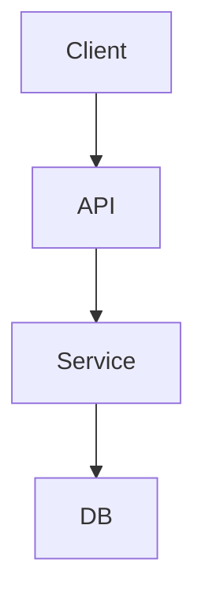

# SPEC

## Meta
- name: specflow-seed
- version: 0.1.0

## Scope
### In
- API endpoint to create to-dos
- Validation of required fields
### Out
- Authentication management
- Web UI

## Use Cases
### UC-01 - Create to-do
- Actor: Authenticated user
#### Main Flow
- 1. The client sends POST /todos with title and description
- 2. The system validates required fields
- 3. The system persists the to-do and returns 201
#### Alternative Flows
- A1. Empty title → return 422 with code TITLE_REQUIRED

## Acceptance Criteria
### AC-01 -> UC-01
- Given: A valid payload
- When: POST /todos
- Then: Responds 201 with the to-do payload
- Tests: tests/todos/create.todo.test.ts#AC-01
### AC-02 -> UC-01
- Given: Missing title
- When: POST /todos
- Then: Responds 422 with code TITLE_REQUIRED
- Tests: tests/todos/create.todo.test.ts#AC-02

## Contracts
### API-01 POST /todos
- Errors: 422:TITLE_REQUIRED

## Services
### TodoService
- Validate payload
- Create to-do

## Operations
### OP-01 - createTodo
- Service: TodoService
- AC: AC-01, AC-02

## Data Flows
### DF-01 - UC-01
- client -> api
- api -> service
- service -> db

## Database
### todos
- id uuid
- user_id uuid
- title varchar(120)
- description text
